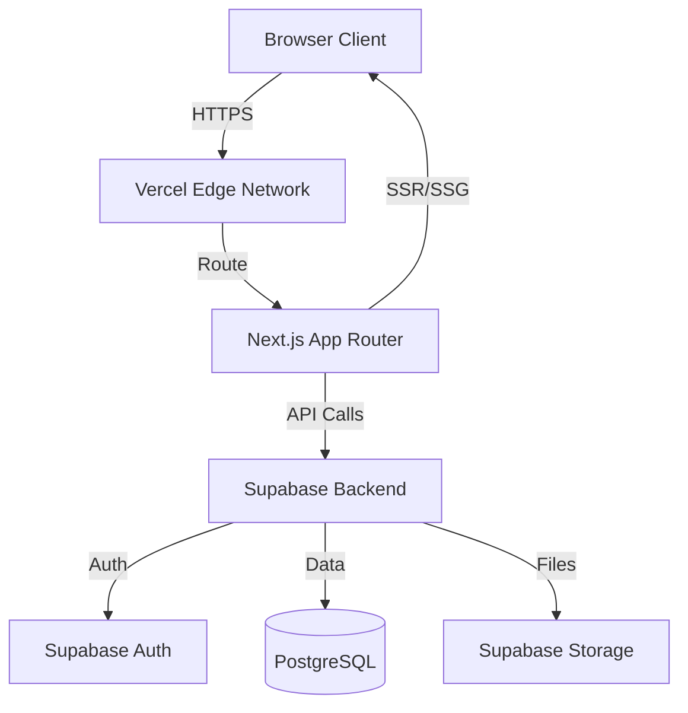
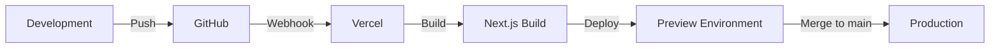

# Design Document

## Overview

RakGame is a full-stack web application built with Next.js 14+ (App Router), TailwindCSS, and Supabase. The system follows a modern serverless architecture with client-side rendering for dynamic content and server components for initial page loads. The application is deployed on Vercel with automatic CI/CD from GitHub.

The design emphasizes:
- Clean, dashboard-style UI inspired by gaming platforms (PlayStation Store, Xbox Store, Nintendo eShop)
- Real-time data synchronization via Supabase
- Responsive design supporting desktop, tablet, and mobile devices
- Type-safe development with TypeScript
- Component-based architecture for maintainability

## Architecture

### High-Level Architecture



### Technology Stack

**Frontend:**
- Next.js 14+ (App Router with React Server Components)
- React 18+
- TypeScript 5+
- TailwindCSS 3+ for styling
- Shadcn/ui for component library
- React Hook Form for form management
- Zod for validation
- Nivo for analytics visualization (primary)
- Recharts as fallback option (Phase 2)

**Backend & Database:**
- Supabase (PostgreSQL 15+)
- Supabase Auth for authentication
- Supabase Storage for image uploads
- Row Level Security (RLS) for data protection

**Deployment:**
- Vercel (hosting and CI/CD)
- GitHub (version control)
- Environment variables for configuration

## Components and Interfaces

### Frontend Component Structure

```
app/
├── (auth)/
│   ├── login/
│   │   └── page.tsx
│   ├── register/
│   │   └── page.tsx
│   └── layout.tsx
├── (dashboard)/
│   ├── dashboard/
│   │   └── page.tsx
│   ├── collection/
│   │   └── page.tsx
│   ├── sellers/
│   │   └── page.tsx
│   ├── analytics/
│   │   └── page.tsx
│   └── layout.tsx
├── api/
│   ├── games/
│   │   └── route.ts
│   ├── sellers/
│   │   └── route.ts
│   └── export/
│       └── route.ts
└── layout.tsx

components/
├── ui/
│   ├── button.tsx
│   ├── card.tsx
│   ├── dialog.tsx
│   ├── form.tsx
│   ├── input.tsx
│   ├── select.tsx
│   └── table.tsx
├── games/
│   ├── game-card.tsx
│   ├── game-form.tsx
│   ├── game-list.tsx
│   └── game-filters.tsx
├── sellers/
│   ├── seller-form.tsx
│   └── seller-list.tsx
├── analytics/
│   ├── spending-chart.tsx
│   ├── platform-breakdown.tsx
│   └── seller-breakdown.tsx
├── layout/
│   ├── sidebar.tsx
│   ├── header.tsx
│   └── theme-toggle.tsx
└── shared/
    ├── search-bar.tsx
    ├── export-button.tsx
    └── loading-spinner.tsx

lib/
├── constants/
│   └── regions.ts        # Region definitions with flags
├── hooks/
│   ├── use-games.ts
│   ├── use-sellers.ts
│   └── use-analytics.ts
├── utils/
│   ├── export.ts
│   └── validation.ts
└── types/
    └── database.ts
├── supabase/
│   ├── client.ts
│   ├── server.ts
│   └── middleware.ts
├── hooks/
│   ├── use-games.ts
│   ├── use-sellers.ts
│   └── use-analytics.ts
├── utils/
│   ├── format.ts
│   ├── validation.ts
│   └── export.ts
└── types/
    ├── database.ts
    ├── game.ts
    └── seller.ts
```

### Key Component Interfaces

**GameCard Component:**
```typescript
interface GameCardProps {
  game: Game;
  onEdit: (game: Game) => void;
  onDelete: (id: string) => void;
  showDuplicateWarning?: boolean;
}
```

**GameForm Component:**
```typescript
interface GameFormProps {
  game?: Game;
  sellers: Seller[];
  onSubmit: (data: GameFormData) => Promise<void>;
  onCancel: () => void;
}
```

**AnalyticsChart Component:**
```typescript
interface AnalyticsChartProps {
  data: SpendingData[];
  groupBy: 'platform' | 'seller' | 'month';
  chartType: 'bar' | 'pie' | 'line';
}
```

## Data Models

### Database Schema

**users table:**
```sql
CREATE TABLE users (
  id UUID PRIMARY KEY REFERENCES auth.users(id),
  email TEXT NOT NULL UNIQUE,
  currency TEXT NOT NULL DEFAULT 'THB' CHECK (currency IN ('THB', 'AUD', 'USD', 'EUR', 'GBP', 'JPY')),
  language TEXT NOT NULL DEFAULT 'th' CHECK (language IN ('en', 'th')),
  created_at TIMESTAMP WITH TIME ZONE DEFAULT NOW()
);
```

**sellers table:**
```sql
CREATE TABLE sellers (
  id UUID PRIMARY KEY DEFAULT gen_random_uuid(),
  user_id UUID NOT NULL REFERENCES users(id) ON DELETE CASCADE,
  name TEXT NOT NULL,
  url TEXT,
  note TEXT,
  created_at TIMESTAMP WITH TIME ZONE DEFAULT NOW(),
  UNIQUE(user_id, name)
);
```

**games table:**
```sql
CREATE TABLE games (
  id UUID PRIMARY KEY DEFAULT gen_random_uuid(),
  user_id UUID NOT NULL REFERENCES users(id) ON DELETE CASCADE,
  seller_id UUID REFERENCES sellers(id) ON DELETE SET NULL,
  title TEXT NOT NULL,
  platform TEXT NOT NULL,
  type TEXT NOT NULL CHECK (type IN ('Disc', 'Digital')),
  price NUMERIC(10, 2) NOT NULL CHECK (price >= 0),
  purchase_date DATE NOT NULL,
  region TEXT, -- Stores full region name (e.g., 'United States', 'Japan', 'Thailand')
  condition TEXT CHECK (condition IN ('New', 'Used', NULL)),
  notes TEXT,
  image_url TEXT,
  created_at TIMESTAMP WITH TIME ZONE DEFAULT NOW()
);
```

**Row Level Security Policies:**
```sql
-- Users can only access their own data
ALTER TABLE sellers ENABLE ROW LEVEL SECURITY;
ALTER TABLE games ENABLE ROW LEVEL SECURITY;

CREATE POLICY "Users can view own sellers"
  ON sellers FOR SELECT
  USING (auth.uid() = user_id);

CREATE POLICY "Users can insert own sellers"
  ON sellers FOR INSERT
  WITH CHECK (auth.uid() = user_id);

CREATE POLICY "Users can update own sellers"
  ON sellers FOR UPDATE
  USING (auth.uid() = user_id);

CREATE POLICY "Users can delete own sellers"
  ON sellers FOR DELETE
  USING (auth.uid() = user_id);

-- Similar policies for games table
```

### TypeScript Types

**Core Types:**
```typescript
export interface User {
  id: string;
  email: string;
  currency: Currency;
  language: Language;
  created_at: string;
}

export interface Game {
  id: string;
  user_id: string;
  seller_id: string | null;
  title: string;
  platform: Platform;
  type: GameType;
  price: number;
  purchase_date: string;
  region?: string;
  condition?: Condition;
  notes?: string;
  image_url?: string;
  created_at: string;
  seller?: Seller;
}

export interface Seller {
  id: string;
  user_id: string;
  name: string;
  url?: string;
  note?: string;
  created_at: string;
}

export type Currency = 'THB' | 'AUD' | 'USD' | 'EUR' | 'GBP' | 'JPY';
export type Language = 'en' | 'th';
export type Platform = 'Switch' | 'Switch 2' | 'PS5' | 'PS4' | 'Xbox Series X|S' | 'Xbox One' | 'PC' | 'Other';
export type GameType = 'Disc' | 'Digital';
export type Condition = 'New' | 'Used';

export interface Region {
  code: string;        // Full name used as identifier (e.g., 'United States', 'Japan')
  name: string;        // Display name (same as code)
  flag: string;        // Unicode flag emoji (e.g., '🇺🇸', '🇯🇵')
  popular: boolean;    // Whether to show in popular regions section
}

export interface SpendingAnalytics {
  total: number;
  currency: Currency;
  byPlatform: Record<Platform, number>;
  bySeller: Record<string, number>;
  byMonth: Record<string, number>;
  gameCount: number;
}
```

### Region Management

**Implementation Approach:**

Regions are managed through a constant array defined in `lib/constants/regions.ts` rather than a database table. This approach provides:
- Fast performance (no database queries needed)
- Easy maintenance (regions rarely change)
- Consistent data across all users
- Simple implementation without schema changes

**Region Data Structure:**

The regions constant includes:
- **Popular Regions** (7 regions): Displayed first in dropdowns for quick access
  - Thailand (default), Asia, North America, Europe, Japan, Australia, Turkey
- **Other Regions** (40+ regions): Alphabetically sorted, searchable list of additional countries including United States, Canada, United Kingdom, China, South Korea, Singapore, and more

**UI Implementation:**

The region selector uses a Select component with:
1. "Popular Regions" section at the top with flag emojis
2. Visual separator
3. "Other Regions" section below, alphabetically sorted
4. Each option displays: `[flag emoji] [full country name]`
5. Maximum height with scrolling for long lists

**Storage:**

- Database stores the full region name as text (e.g., "United States", "Japan", "Thailand")
- No foreign key relationships or separate region table needed
- Backward compatible with existing free-text region data

**Display:**

When displaying games, the system:
1. Looks up the region code in the REGIONS constant
2. Shows the flag emoji + full name (e.g., "🇹🇭 Thailand")
3. Falls back to plain text if region not found in constants

## Error Handling

### Error Categories

1. **Authentication Errors:**
   - Invalid credentials
   - Session expired
   - Email already registered
   - Password reset failures

2. **Validation Errors:**
   - Missing required fields
   - Invalid data formats
   - File size exceeded
   - Unsupported file types

3. **Database Errors:**
   - Connection failures
   - Constraint violations
   - Query timeouts
   - RLS policy violations

4. **Network Errors:**
   - Request timeouts
   - Connection lost
   - API rate limits
   - Server unavailable

### Error Handling Strategy

**Client-Side:**
```typescript
// Custom error handler hook
export function useErrorHandler() {
  const showToast = useToast();
  
  return (error: Error) => {
    if (error instanceof AuthError) {
      showToast({
        title: 'Authentication Error',
        description: error.message,
        variant: 'destructive'
      });
    } else if (error instanceof ValidationError) {
      showToast({
        title: 'Validation Error',
        description: error.message,
        variant: 'warning'
      });
    } else {
      showToast({
        title: 'Error',
        description: 'An unexpected error occurred',
        variant: 'destructive'
      });
      console.error(error);
    }
  };
}
```

**Server-Side:**
```typescript
// API route error handling
export async function POST(request: Request) {
  try {
    const data = await request.json();
    // Process request
    return NextResponse.json({ success: true });
  } catch (error) {
    if (error instanceof ZodError) {
      return NextResponse.json(
        { error: 'Validation failed', details: error.errors },
        { status: 400 }
      );
    }
    return NextResponse.json(
      { error: 'Internal server error' },
      { status: 500 }
    );
  }
}
```

**Offline Handling:**
- Display offline indicator when network is unavailable
- Queue mutations for sync when connection restored
- Show cached data with staleness indicator
- Prevent form submissions during offline state

## Testing Strategy

### Testing Approach

The testing strategy focuses on core functionality with minimal overhead:

1. **Component Testing:**
   - Test critical user interactions
   - Verify form validation logic
   - Test conditional rendering

2. **Integration Testing:**
   - Test API routes with mock Supabase client
   - Verify authentication flows
   - Test data synchronization

3. **End-to-End Testing:**
   - Test complete user workflows
   - Verify cross-browser compatibility
   - Test responsive behavior

### Testing Tools

- **Vitest** for unit and integration tests
- **React Testing Library** for component tests
- **Playwright** for E2E tests (optional)
- **MSW (Mock Service Worker)** for API mocking

### Test Coverage Goals

- Critical paths: 80%+ coverage
- Utility functions: 90%+ coverage
- UI components: 60%+ coverage
- Overall: 70%+ coverage

### Example Test Structure

```typescript
// Game form validation test
describe('GameForm', () => {
  it('should validate required fields', async () => {
    const onSubmit = vi.fn();
    render(<GameForm sellers={[]} onSubmit={onSubmit} />);
    
    const submitButton = screen.getByRole('button', { name: /save/i });
    await userEvent.click(submitButton);
    
    expect(screen.getByText(/title is required/i)).toBeInTheDocument();
    expect(onSubmit).not.toHaveBeenCalled();
  });
  
  it('should detect duplicate games', async () => {
    const existingGames = [
      { title: 'Zelda', platform: 'Switch' }
    ];
    
    render(<GameForm sellers={[]} existingGames={existingGames} />);
    
    await userEvent.type(screen.getByLabelText(/title/i), 'Zelda');
    await userEvent.selectOptions(screen.getByLabelText(/platform/i), 'Switch');
    
    expect(screen.getByText(/duplicate detected/i)).toBeInTheDocument();
  });
});
```

## Performance Considerations

### Optimization Strategies

1. **Data Fetching:**
   - Use React Server Components for initial data load
   - Implement pagination for large collections (50 items per page)
   - Cache analytics calculations
   - Use Supabase real-time subscriptions sparingly

2. **Image Optimization:**
   - Use Next.js Image component for automatic optimization
   - Lazy load images below the fold
   - Compress uploads to max 500KB
   - Generate thumbnails for list views

3. **Bundle Optimization:**
   - Code splitting by route
   - Dynamic imports for heavy components (charts, PDF generator)
   - Tree-shake unused dependencies
   - Minimize third-party libraries

4. **Caching Strategy:**
   - Cache static assets with long TTL
   - Use SWR for client-side data caching
   - Implement optimistic updates for better UX
   - Cache analytics data for 5 minutes

### Performance Targets

- First Contentful Paint: < 1.5s
- Time to Interactive: < 3s
- Lighthouse Score: > 90
- Bundle Size: < 200KB (initial)

## Security Considerations

### Authentication & Authorization

- Supabase Auth with email/password
- JWT tokens with automatic refresh
- Row Level Security on all tables
- Server-side session validation

### Data Protection

- HTTPS only (enforced by Vercel)
- Environment variables for secrets
- Input sanitization on all forms
- SQL injection prevention via Supabase client
- XSS prevention via React's built-in escaping

### File Upload Security

- Validate file types (images only)
- Limit file size to 5MB
- Scan for malicious content
- Store in Supabase Storage with access policies
- Generate unique filenames to prevent overwrites

## Deployment & DevOps

### Deployment Pipeline



### Environment Configuration

**Development:**
```env
NEXT_PUBLIC_SUPABASE_URL=https://xxx.supabase.co
NEXT_PUBLIC_SUPABASE_ANON_KEY=xxx
SUPABASE_SERVICE_ROLE_KEY=xxx
```

**Production:**
- Same variables configured in Vercel dashboard
- Automatic HTTPS via Vercel
- Custom domain: rakgame.app
- Edge caching enabled

### Monitoring

- Vercel Analytics for performance metrics
- Supabase Dashboard for database monitoring
- Error tracking via console logs (future: Sentry)
- User feedback collection via in-app form

## Future Enhancements

### Phase 2 Features

1. **PWA Support:**
   - Service worker for offline access
   - Install prompt for mobile devices
   - Push notifications for wishlist items

2. **API Integration:**
   - IGDB API for game metadata
   - Auto-populate game details
   - Cover art fetching

3. **Social Features:**
   - Public profile pages
   - Collection sharing
   - Friend comparisons

4. **Advanced Analytics:**
   - Price trends over time
   - Collection value estimation
   - Spending predictions

5. **Enhanced Localization:**
   - Additional languages
   - Currency conversion
   - Regional pricing data
